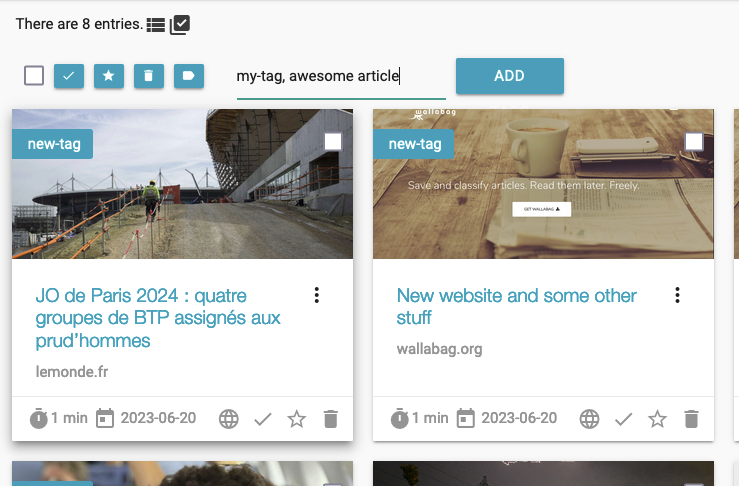
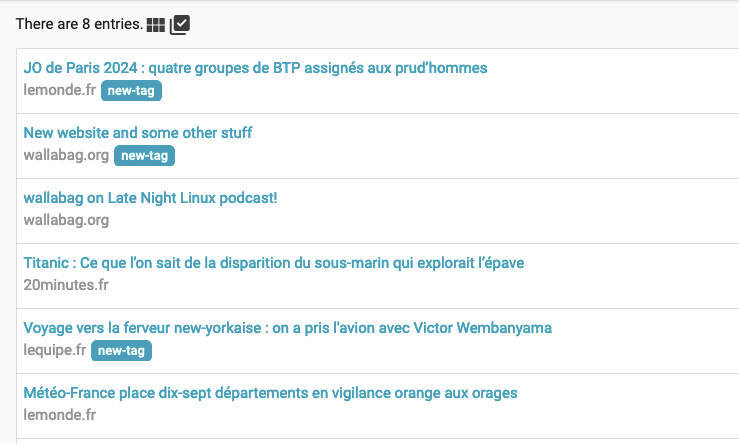
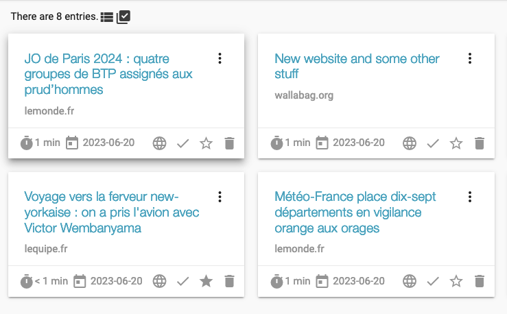

wallabag 🦘turns 10 🎂 ! To celebrate this birthday, we are pleased to announce the release of [wallabag 2.6.0](https://github.com/wallabag/wallabag/releases/tag/2.6.0).

We developed this release during a year and I want to thank [each of the contributors](https://github.com/wallabag/wallabag/releases/tag/2.6.0).

I hope you will love the new features and the fixes we made.

## Have a look on some new features

wallabag is 10: it's starting to get a little rusty. That's why we made a lot of effort to improve technical stuff, under the hood.
Most of this work was done by [Yassine](https://github.com/yguedidi): thank you so much! Thanks to him, wallabag can go forward (for the next 10 years?).

### Mass action to tag entries, by @Kdecherf

We now have a nice interface on card view (thank you, @Simounet!). A checkbox is available on each card.

And Kevin added the mass tagging feature: what a pleasure to add many tags on several articles!

### Enhance the availability of the add a new URL in the web interface, by @Simounet

The "+" icon in the header bar is not so big. When you have a lot of URL to save, it can be painful to click exactly on the icon.

@Simounet increased the clickable area and you can now click on all the header bar.

### New setting to show / hide articles thumbnails, by @nicosomb

@Oppen asked us to add a new setting to show or hide articles thumbnails.

This feature is so useful for slow connections or for instances which have few resources.

That's why we developed it for 2.6.0. See below the result when you chose to hide thumbnails.

## Update your instance

📈  **To update your instance**, [just run `make update`](https://doc.wallabag.org/en/admin/upgrade.html).
Don't forget to make a backup of your instance (database and files).

_🤝  A little reminder that **you can support our work** on wallabag by sponsoring us on [Liberapay](https://liberapay.com/wallabag) or subscribe on [wallabag.it](https://www.wallabag.it/en). Thanks!_

## Changelog

You can read the [full Changelog](https://github.com/wallabag/wallabag/compare/2.5.4...2.6.0) on GitHub.

## Download wallabag 2.6.0

To download, install/upgrade wallabag, [please read our Downloads page](https://doc.wallabag.org/en/admin/installation/installation.html).

## Need help?

[We are on Gitter](https://gitter.im/wallabag/wallabag), ping us!

You can also open a [new issue on GitHub](https://github.com/wallabag/wallabag/issues/new).

## How can you help us?

By using wallabag, by reporting bugs, by translating wallabag and its documentation, by talking about wallabag to your friends, ...

You can also help us by donating via [Liberapay](https://liberapay.com/wallabag/).
