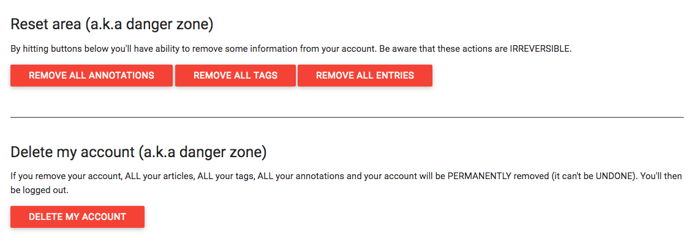
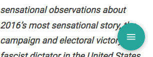

With almost 4 months delay, **our new version, wallabag 2.2, is here**. We originally planned to release it on October 3rd, 2016.
Don’t worry, we didn’t go on holiday. We kept working hard.
**It’s now time to present you this new great version**.


## What’s new?

### Account managemenent

In wallabag 2.1, [we gave you the possibility to manage your users](https://wallabag.org/en/news/wallabag-21).

In wallabag 2.2, we now give you the possibility to **reset and delete your own account**.

On the configuration screen of your account, in the **user information** tab, you now have a **danger zone**. Take care, these actions are IRREVERSIBLE.

You can:
* remove all annotations
* remove all tags
* remove all entries
* delete your account



*Features developed by tcitworld and j0k3r in [\#2177](https://github.com/wallabag/wallabag/pull/2177) and [\#2401](https://github.com/wallabag/wallabag/pull/2401)*

### API

Two useful enhancements for developers: **annotations and entries export are now available in the API**.

#### Export entries

The endpoint is `/api/entries/123/export.epub` to export the entry `123` in `epub` (available formats: epub, mobi, pdf, txt, csv).

This feature is already used by [Plop! reader](http://plop-reader.pascal-martin.fr/), a wallabag application for Pocketbook Touch Lux ereaders, by pmartin.

*Feature developed by pmartin in [\#2372](https://github.com/wallabag/wallabag/pull/2372)*

#### Annotations

The endpoint is `api/annotations/123.json` to get annotations for the entry `123`.

*Feature developed by tcitworld in [\#1890](https://github.com/wallabag/wallabag/pull/1890)*

### UI changes
* We added new tag form in mobile view for Material theme. *Developed by nicosomb in [\#2553](https://github.com/wallabag/wallabag/pull/2553)*
* We added a list view, which hides the preview picture and displays only the title. *Developed by nicosomb in [\#2662](https://github.com/wallabag/wallabag/pull/2662)*
* On mobile view, for long articles, we added a floating button to archive, star or delete an entry. *Developed by nicosomb in [\#2670](https://github.com/wallabag/wallabag/pull/2670)*



### Sharing

You can now **share your entries to [unmark.it](https://unmark.it/)**, a bookmarks manager.

*Feature developed by nicosomb in [\#2566](https://github.com/wallabag/wallabag/pull/2566)*

Sharing to Shaarli (an other bookmarks manager) is available since wallabag 2.0. But **lapineige**, one of our happy users, wanted to share tags into Shaarli. So he developed this feature.

*Feature developed by lapineige in [\#2725](https://github.com/wallabag/wallabag/pull/2725)*

### Import

In wallabag 2.1, we added many import systems: Readability, Instapaper, Firefox and Chrome.

With wallabag 2.2, **you can also import your data from Pinboard**.

*Feature developed by j0k3r in [\#2548](https://github.com/wallabag/wallabag/pull/2548)*

### Features
* Available in wallabag 1.x, **downloading pictures has been added**. You need to enable the feature in the internal settings of your wallabag. *Developed by tcitworld and j0k3r in [\#2180](https://github.com/wallabag/wallabag/pull/2180)*
* If you don’t like to remove your fingers from your keyboard, **we added shortcuts**. You can have a glance of all the available shortcuts by hitting the `?` key. *Developed by nicosomb in [\#2495](https://github.com/wallabag/wallabag/pull/2495)*
* Wanted for months, **the search engine is finally available** in wallabag. Click on the magnifying glass icon in the header to display the search form. *Developed by nicosomb in [\#2543](https://github.com/wallabag/wallabag/pull/2543)*
* We added a new setting to define **the redirection made after archiving an entry**: define it on the configuration page. *Developed by nicosomb in [\#2547](https://github.com/wallabag/wallabag/pull/2547)*
* **To avoid too large RSS feeds**, it’s now possible to limit them. Define this value on your configuration page. *Developed by j0k3r in [\#2609](https://github.com/wallabag/wallabag/pull/2609)*

### One more thing… the authentication for restricted access articles (behind a paywall)

Thanks to this feature, you can now save articles from websites who authentication is required.

This great feature is only available for advanced users, and for now the credentials are shared with all the users of an instance. We’ll add an easy to use interface in next release.

You need to edit your `app/config/parameters.yml` file to edit credentials for each website with paywall. Here is an example for some french websites:

```
sites_credentials:
    mediapart.fr: {username: "johndoe", password: "johnwho?"}
```

> **Warning : These credentials will be used for each user of your wallabag instance.**

Then, the site configuration file for the website (for example, `mediapart.fr.txt`) must be improved:

```
title://h1[@class="title"]
body: //div[@class="content-article"]/div[@class="page-pane"]

requires_login: yes

login_uri: https://www.mediapart.fr/login_check
login_username_field: name
login_password_field: password

not_logged_in_xpath: //body[@class="not-logged-in"]
```

Please [open a new issue on GitHub](https://github.com/wallabag/wallabag/issues/new) if you need some help about this part.

*Feature developed by bdunogier in [\#2317](https://github.com/wallabag/wallabag/pull/2317)*

<hr />
## Some figures

wallabag 2.2 in figures:
- 9826 added lines
- 1079 removed lines
- 72 merged pull requests
- 40 closed issues
- 3 months late
- 1 an other great release

<hr />
## Full changelog

- [#2789](https://github.com/wallabag/wallabag/pull/2789) Added indexes on is_archived and is_starred (@nicosomb)
- [#2763](https://github.com/wallabag/wallabag/pull/2763) Sort list of available tags (@janLo)
- [#2646](https://github.com/wallabag/wallabag/pull/2646) Added explanations about migrations (@nicosomb, @jlnostr)
- [#2787](https://github.com/wallabag/wallabag/pull/2787) Lock kphoen/rulerz to avoid breaking changes (@j0k3r)
- [#2750](https://github.com/wallabag/wallabag/pull/2750) Added migration to rename uuid to uid (@nicosomb)
- [#2774](https://github.com/wallabag/wallabag/pull/2774) add cli export (@tcitworld)
- [#2742](https://github.com/wallabag/wallabag/pull/2742) Avoid false preview image (@j0k3r)
- [#2733](https://github.com/wallabag/wallabag/pull/2733) Fixed API error No matching accepted Response format could be determined (@nicosomb)
- [#2735](https://github.com/wallabag/wallabag/pull/2735) Removed the small element on reading time (@nicosomb)
- [#2729](https://github.com/wallabag/wallabag/pull/2729) Fix double overlay on expanded right sidenav (@Simounet)
- [#2728](https://github.com/wallabag/wallabag/pull/2728) Fix right side-nav scrolling on low height window (@Simounet)
- [#2725](https://github.com/wallabag/wallabag/pull/2725) Share to Shaarli - Include tags (@lapineige,)
- [#2732](https://github.com/wallabag/wallabag/pull/2732) Firefox add-on URL updated (@Simounet)
- [#2730](https://github.com/wallabag/wallabag/pull/2730) Access to search, filters, export on mobile (@Simounet)
- [#2731](https://github.com/wallabag/wallabag/pull/2731) Minor typo fix (@llune)
- [#2702](https://github.com/wallabag/wallabag/pull/2702) Added index on entry.uuid (@nicosomb)
- [#2724](https://github.com/wallabag/wallabag/pull/2724) Fix entry reading time (@Simounet)
- [#2723](https://github.com/wallabag/wallabag/pull/2723) Fixed export by tags with a tag which contains space (@nicosomb)
- [#2696](https://github.com/wallabag/wallabag/pull/2696) Run migration on each test (@j0k3r)
- [#2714](https://github.com/wallabag/wallabag/pull/2714) Fix the box shadow on the card entry (@Simounet)
- [#2616](https://github.com/wallabag/wallabag/pull/2616) Change documentation links to HTTPS (@mathieui)
- [#2682](https://github.com/wallabag/wallabag/pull/2682) Ensure craue_config_setting migration are ok (@nicosomb, @j0k3r)
- [#2690](https://github.com/wallabag/wallabag/pull/2690) Added QoS for RabbitMQ (@nicosomb)
- [#2701](https://github.com/wallabag/wallabag/pull/2701) Removed outputWalkers for pagination (@nicosomb)
- [#2667](https://github.com/wallabag/wallabag/pull/2667) Upgrade to Symfony 3.2 (@nicosomb, @j0k3r)
- [#2699](https://github.com/wallabag/wallabag/pull/2699) Removed user join in query builder (@nicosomb)
- [#2697](https://github.com/wallabag/wallabag/pull/2697) Add default value for list_mode (@j0k3r)
- [#2691](https://github.com/wallabag/wallabag/pull/2691) Moved total messages from import (@nicosomb)
- [#2689](https://github.com/wallabag/wallabag/pull/2689) Replaced chmod for download pictures feature (@nicosomb)
- [#2688](https://github.com/wallabag/wallabag/pull/2688) Fixed imports with is_starred and is_archived (@nicosomb)
- [#2686](https://github.com/wallabag/wallabag/pull/2686) Casted maxIterations for Redis import (@nicosomb)
- [#2680](https://github.com/wallabag/wallabag/pull/2680) Limit rule to 255 (@j0k3r)
- [#2679](https://github.com/wallabag/wallabag/pull/2679) Fix content from imported entried being discarded when URL goes bad (@j0k3r, @jcharaoui)
- [#2677](https://github.com/wallabag/wallabag/pull/2677) add translations/wallabag_user.de.yml (fixes #2673) (@Strubbl)
- [#2676](https://github.com/wallabag/wallabag/pull/2676) Updated addons links (@nicosomb)
- [#2674](https://github.com/wallabag/wallabag/pull/2674) Fixed 404 for wallabag logo in 2FA (@nicosomb)
- [#2672](https://github.com/wallabag/wallabag/pull/2672) Fixed typo in asynchronous documentation (@nicosomb)
- [#2670](https://github.com/wallabag/wallabag/pull/2670) Added floating button on entry view for mobile (@nicosomb)
- [#2650](https://github.com/wallabag/wallabag/pull/2650) Added hasColumn() in migration to check column existence (@nicosomb)
- [#2662](https://github.com/wallabag/wallabag/pull/2662) Add list view (@nicosomb)
- [#2663](https://github.com/wallabag/wallabag/pull/2663) Removed FOSUser attributes removed in alpha4 (@nicosomb)
- [#2659](https://github.com/wallabag/wallabag/pull/2659) Fix incorrect reading time calculation for entries in non-latin languages. (@akovalyov)
- [#2654](https://github.com/wallabag/wallabag/pull/2654) Enforce lowercase on domain name filter (@Kdecherf)
- [#2622](https://github.com/wallabag/wallabag/pull/2622) Material UI Changes (@nicosomb, @Kdecherf)
- [#2642](https://github.com/wallabag/wallabag/pull/2642) Fixed logout shortcut (@nicosomb)
- [#2620](https://github.com/wallabag/wallabag/pull/2620) Fix password layout (@j0k3r)
- [#2640](https://github.com/wallabag/wallabag/pull/2640) Fixed entry shortcuts available in list view (@nicosomb)
- [#2637](https://github.com/wallabag/wallabag/pull/2637) Update messages.pl.yml (@wallabag)
- [#2317](https://github.com/wallabag/wallabag/pull/2317) Added authentication for restricted access articles (@nicosomb, @bdunogier)
- [#2612](https://github.com/wallabag/wallabag/pull/2612) Added help about shortcuts (@nicosomb)
- [#2635](https://github.com/wallabag/wallabag/pull/2635) Return 304 when content isn't reloaded using the API (@j0k3r)
- [#2613](https://github.com/wallabag/wallabag/pull/2613) Fix card action overlap (@j0k3r)
- [#2614](https://github.com/wallabag/wallabag/pull/2614) Add ability to reload entry from API (@j0k3r)
- [#2632](https://github.com/wallabag/wallabag/pull/2632) Update messages.pl.yml (@wallabag)
- [#2630](https://github.com/wallabag/wallabag/pull/2630) Add white-text class to card-title too (@ThibaudDauce)
- [#2600](https://github.com/wallabag/wallabag/pull/2600) Install assets for shortcuts (@j0k3r)
- [#2601](https://github.com/wallabag/wallabag/pull/2601) Added http_status in Entry entity (@nicosomb)
- [#2593](https://github.com/wallabag/wallabag/pull/2593) Put log in the most common failure tests (@j0k3r)
- [#2592](https://github.com/wallabag/wallabag/pull/2592) Update messages.pl.yml (@wallabag)
- [#2547](https://github.com/wallabag/wallabag/pull/2547) Added a configuration to define the redirection after archiving an entry (@j0k3r, @nicosomb, @Strubbl)
- [#2495](https://github.com/wallabag/wallabag/pull/2495) Added shortcuts (@nicosomb, @tcitworld)
- [#2566](https://github.com/wallabag/wallabag/pull/2566) Added unmark.it sharing (@nicosomb)
- [#2564](https://github.com/wallabag/wallabag/pull/2564) Update messages.pl.yml (@wallabag)
- [#2553](https://github.com/wallabag/wallabag/pull/2553) Added new tag form in mobile view for Material theme (@nicosomb)
- [#2548](https://github.com/wallabag/wallabag/pull/2548) Add Pinboard import (@Strubbl, @j0k3r)
- [#2551](https://github.com/wallabag/wallabag/pull/2551) Removed Maintenance bundle (@nicosomb)
- [#2541](https://github.com/wallabag/wallabag/pull/2541) Update messages.pl.yml (@wallabag)
- [#2540](https://github.com/wallabag/wallabag/pull/2540) Update of the OC version (@Quent-in)
- [#2535](https://github.com/wallabag/wallabag/pull/2535) Use created_at as default sort (@j0k3r)
- [#2180](https://github.com/wallabag/wallabag/pull/2180) Download pictures (@j0k3r, @tcitworld)
- [#2523](https://github.com/wallabag/wallabag/pull/2523) Added QRCode and link to configure android application (@tcitworld, @nicosomb)
- [#2499](https://github.com/wallabag/wallabag/pull/2499) Added relation between API Client and User (@nicosomb)
- [#2496](https://github.com/wallabag/wallabag/pull/2496) Update messages.pl.yml (@wallabag)
- [#2401](https://github.com/wallabag/wallabag/pull/2401) Reset account (@j0k3r)
- [#1890](https://github.com/wallabag/wallabag/pull/1890) bring annotations to API (@j0k3r, @nicosomb, @tcitworld)
- [#2456](https://github.com/wallabag/wallabag/pull/2456) use new tcpdf library version (@tcitworld)
- [#2453](https://github.com/wallabag/wallabag/pull/2453) Fix API export (@j0k3r)
- [#2438](https://github.com/wallabag/wallabag/pull/2438) Update messages.pl.yml (@wallabag)
- [#2372](https://github.com/wallabag/wallabag/pull/2372) API: ability to export entry in all available format (epub, pdf, etc...) (@j0k3r, @pmartin)
- [#2409](https://github.com/wallabag/wallabag/pull/2409) Occitan version update (@Quent-in, @nicosomb)
- [#2177](https://github.com/wallabag/wallabag/pull/2177) Delete user (@j0k3r, @nicosomb, @tcitworld)
<hr />

## Applications and browsers addons

* we released a new addon for [Chrome](https://chrome.google.com/webstore/detail/wallabagger/gbmgphmejlcoihgedabhgjdkcahacjlj), also compatible with [Firefox](https://addons.mozilla.org/firefox/addon/wallabagger/) and [Opera](https://addons.mozilla.org/firefox/addon/wallabagger/). It's our new default browser application.
* [we released a new iOS application](https://appsto.re/fr/YeqYfb.i)
* we’ll release a new version of our Android application with the new offline pictures feature very soon.

<hr />

## Download wallabag 2.2

To **download, install/upgrade wallabag**, [please read our Downloads page](http://doc.wallabag.org/en/master/user/installation.html#installation).

<hr />

## Don’t want to host wallabag by yourself?

On December 2016, [**wallabag.it** was launched](https://wallabag.it). wallabag.it is a paid service to use wallabag without installing it on a web server.

This service already ships wallabag 2.2. [You can create your account here](https://app.wallabag.it/). Try it for free: you'll get a 14-day free trial with no limitation (no credit card information required). It’s only €9 (offer valid until March 1, 2017, it will be €12 after this date).

<hr />

## Need help?

[We are on Gitter](https://gitter.im/wallabag/wallabag) and [on IRC](irc://irc.freenode.net/wallabag), ping us! You can also open a [new issue on GitHub](https://github.com/wallabag/wallabag/issues/new).

<hr />

## How can you help us?

By using wallabag, by reporting bugs, by translating wallabag and its documentation, by talking about wallabag to your friends, ...
