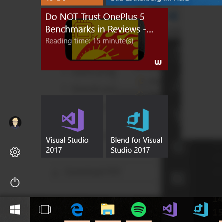
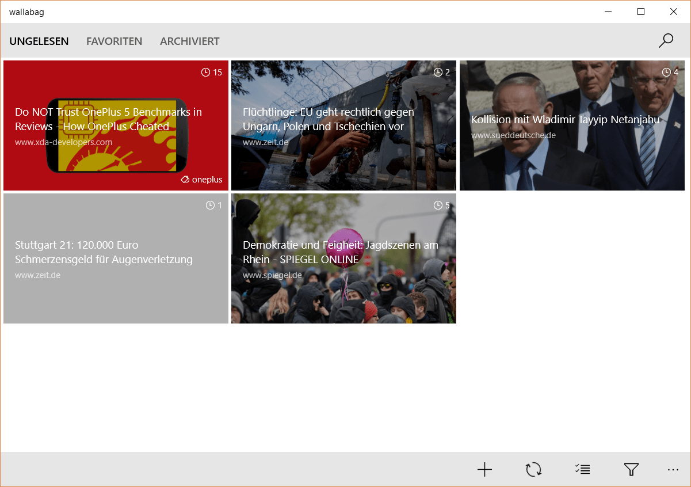
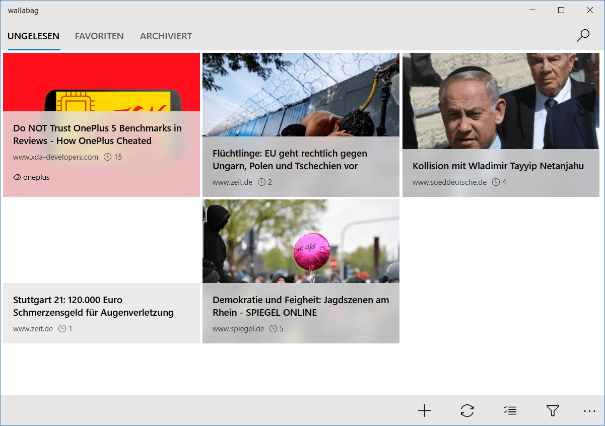
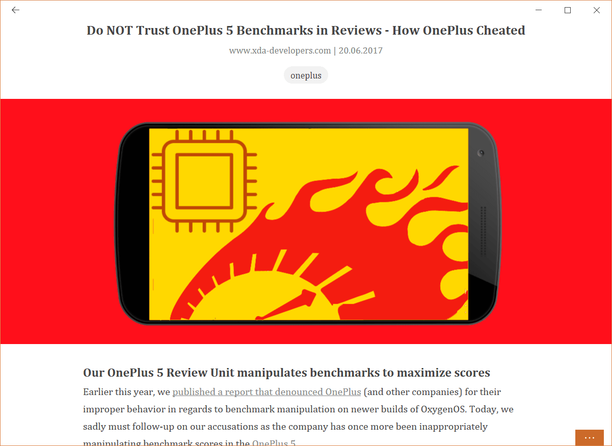
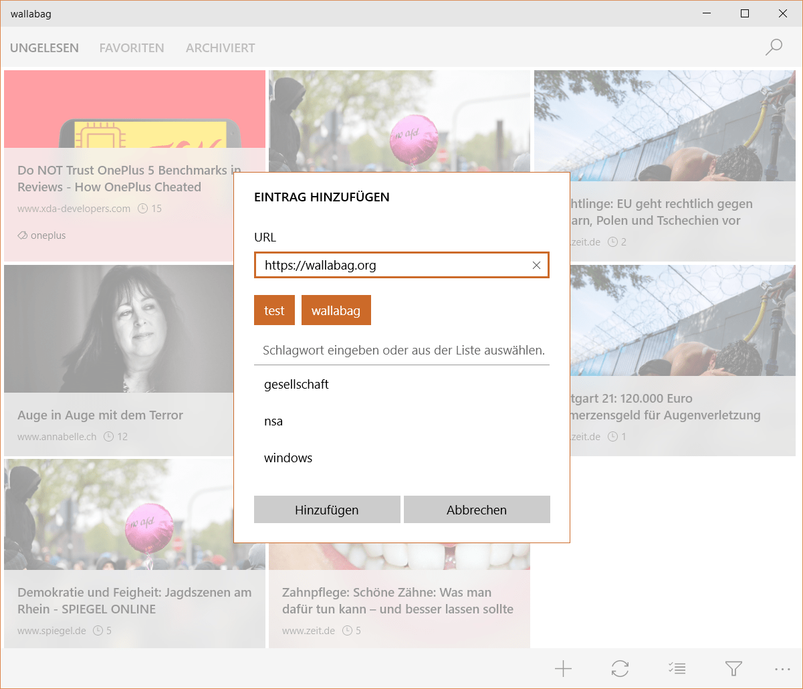
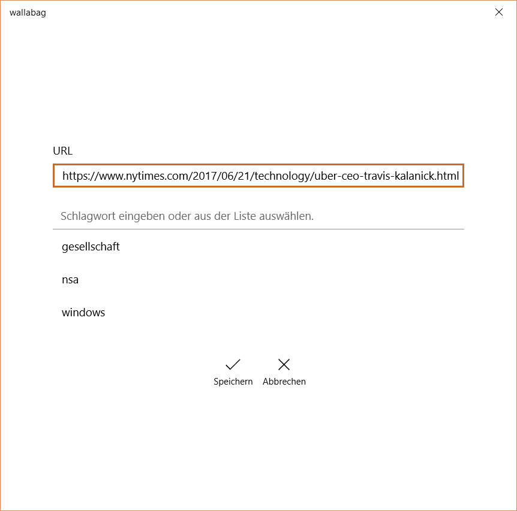
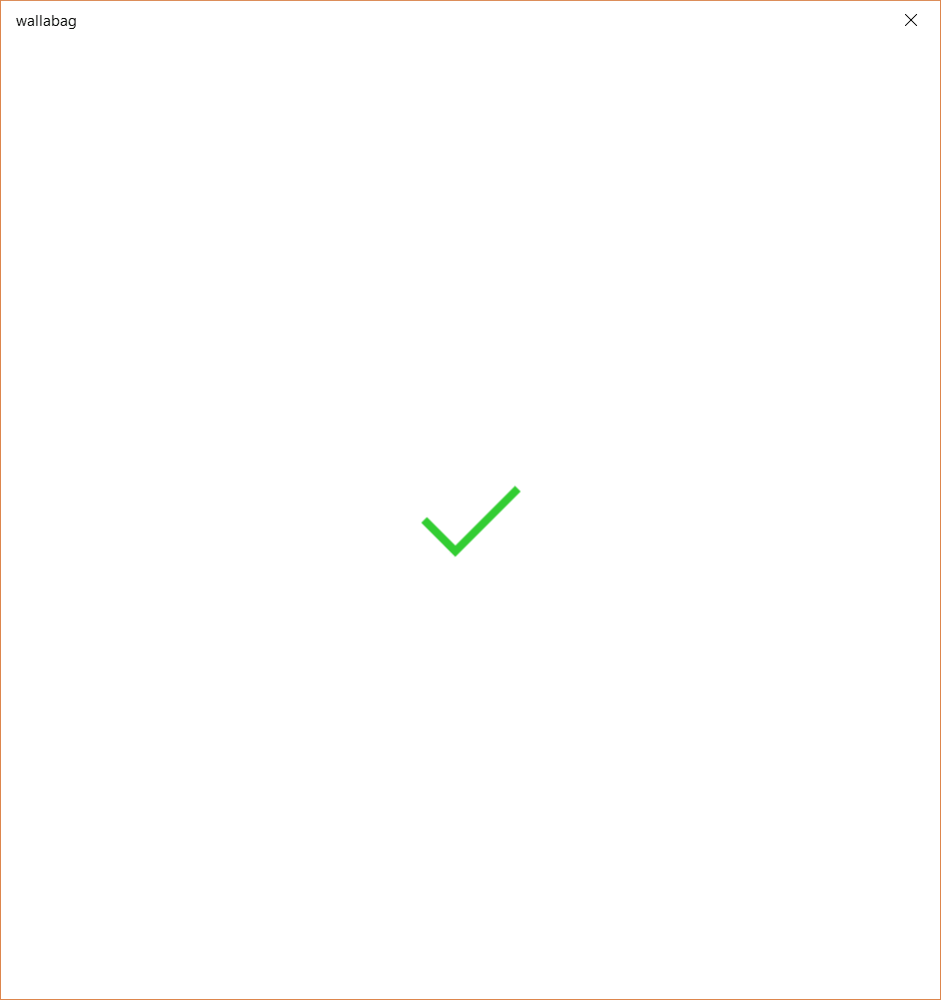
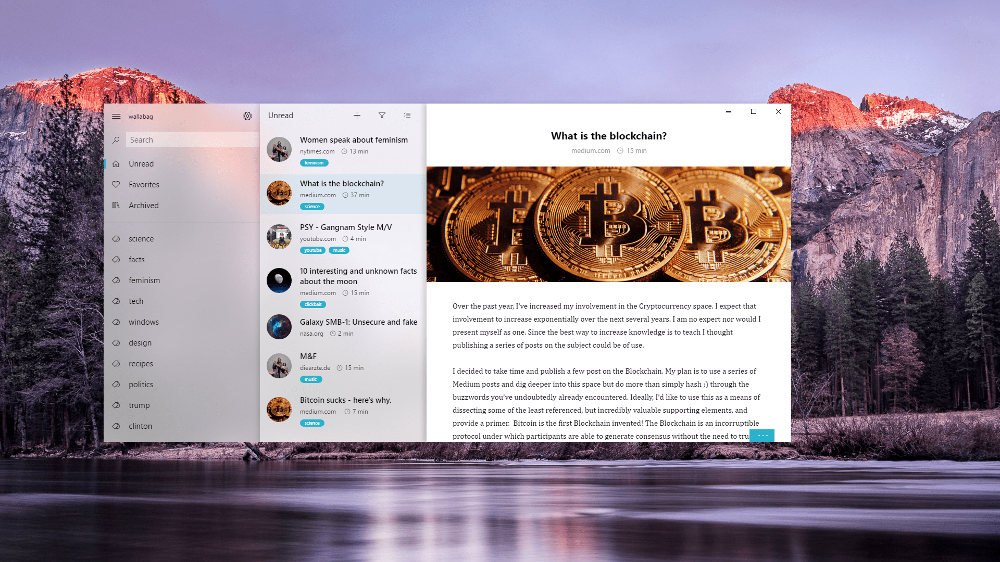

You may have wondered what I've meant with the latest changelog that describes itself as "preparation for the next big update". Well, today I'm telling you by announcing version **2.2.0 of the Windows app**.

During the last months (I think I started working on this update in February), I've did a lot of changes. And while the app still behaves like the previous versions, it changed completely under the hood. What this means for you? Less bugs, faster integration of features and therefore faster updates.

Nevertheless, it's not just a bug fixing update, I've also got some features for you.

## Live Tiles
One of the most wanted features was the *live tile* integration. And now they are finally here! Displaying the most recent articles of a selected list by you, may it be unread, favorited or archived articles. With or without the badge, this is up to you!

## Design changes
Personally, I found it hard to read the titles on the main page. Therefore I performed a lot of experiments and came out with this stunning result:

## Tags on the article view
Some of you wanted to know, what tags are attached to the current post. While visible on the main view, it was unknown on the reading view. Now the tags are displayed under the header, almost the same as on the website.

## Improved tag control
I've improved the tags control. Tags are now easier to add with the suggestion list below the text field.

## New share page
With the Windows 10 Creators Update, the default behaviour for sharing something to an app, like sharing a webpage from Microsoft Edge to wallabag, changed a bit. The app now reacts to this by displaying a indicator and a checkmark when the article was saved. Try it out for yourself!

## Login dialog
Some of you reported an issue where the app stopped working after a certain time. This was due to a conflict in the authentication process. Mostly it happened when the user opened the app but lost internet connection during the authentication process, so I can do nothing about it. For future wallabag versions, the authentication is improved on the server side, so this bug is never occuring again.

In the meantime, the app will ask your for the credentials again to continue working.

## What's coming next?
Microsoft announced their concept of "Fluent Design" a while ago. I personally really like it and below there's a concept of how I might realize it.

Two other features of wallabag are planned a for a future update: Annotation support and the export of articles.

Stay tuned,

Julian
