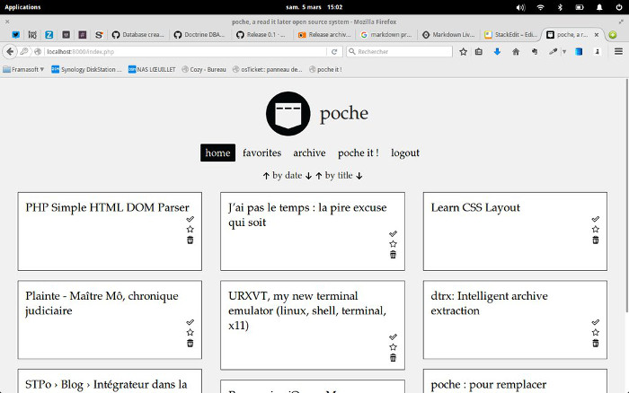

## Some history, some thanks

[Three years ago, I started a little script, to replace the closed service I used to use](http://loeuillet.org/poche-pour-remplacer-instapaper-pocket-et-readability) (french article). It was a personal script, that I hosted on GitHub. I never realized that people could be interested with it.



[You are more than 8.900 users on Framabag](https://framabag.org/analytics/), [you are more than 1.800 fans on GitHub](https://github.com/wallabag/wallabag/stargazers), wallabag 1.x was downloaded more than 33.400 times, [we released so many versions](https://www.wallabag.org/pages/releases.html) with so many features, and our history can still go on.

To all of our users: **Merci**.

If our project is still alive today, it's also thanks to Thomas Citharel ([@tcitworld](https://twitter.com/tcitworld)). When I was not available for the project, he was always here to fix bugs or to reply to your questions. **Merci Thomas**!

wallabag v2 is in my head for more than 2 years. But this version that we release today is also here thanks to Jérémy Benoist ([@j0k](https://twitter.com/j0k))): without his help on many technical subjects, wallabag v2 wouldn't exist. **Merci Jérémy**!

Managing such a project like wallabag is so exciting (but it's also very tiring). Today, it's a big part of my personal life, that's why I also want to thank my wife, because it's not easy every day to share your life with a wallaby. **Merci Audrey**!

Enough with this...

## wallabag 2.0.0 is here!

### Features

* save an article, read it, favorite it, archive it. (Hopefully)
* annotations: In each article you read, you can write annotations. ([read the doc](http://doc.wallabag.org/en/master/user/annotations.html))
* filter entries by reading time, domain name, creation date, status, etc.
* assign tags to entries
* edit article titles
* a REST API ([you can have a look to the documentation](http://v2.wallabag.org/api/doc))
* authorization via oAuth2
* a new default theme, called `material`
* RSS feeds (with ability to limit number of articles)
* create a new account from the config page (for super admin only)
* recover passwords from login page (you have to fill your email on config page)
* picture preview, if available, is displayed for each entry
* Public registration
* migration from wallabag v1/v2 (based on JSON export) ([read the doc](http://doc.wallabag.org/en/master/user/import.html))
* migration from Pocket (it works, but we need to implement asynchronous import: if you have too many articles, it can fail) ([read the doc](http://doc.wallabag.org/en/master/user/import.html))
* exports in many formats (PDF, JSON, EPUB, MOBI, XML, CSV and TXT).
* 2-Factor authentication via email ([read the doc](http://doc.wallabag.org/en/master/user/configuration.html#two-factor-authentication))
* Tagging rule: create a rule to automatically assign tags to entries! ([read the doc](http://doc.wallabag.org/en/master/user/configuration.html#tagging-rules))
* Occitan, German, French, Turkish, Persian, Romanian, Polish, Danish, Spanish and English translations
* Quickstart for beginners (when you don't have any entries)
* Internal settings for administrator (the account created during installation)
* For 3rd apps developers, a developer page is available to create API token

The documentation for this release is here: [http://doc.wallabag.org/](http://doc.wallabag.org/). Today, we translated it in English and in [French](http://doc.wallabag.org/fr/master/): if you want to translate it in an other language, [please read this chapter](http://doc.wallabag.org/en/master/developer/translate.html#wallabag-documentation).

### Download wallabag 2.0.0

### On a dedicated web server

If you don't have it yet, please [install composer](https://getcomposer.org/download/). Then you can install wallabag by executing the following commands:

```
git clone https://github.com/wallabag/wallabag.git
cd wallabag
git checkout 2.0.0
SYMFONY_ENV=prod composer install --no-dev -o --prefer-dist
php bin/console wallabag:install --env=prod
php bin/console server:run --env=prod
```

### On a shared hosting

We provide you a package, `wallabag-2.0.0.tar.gz`, with all dependancies inside.

The default configuration uses SQLite for the database. If you want to change these settings, please edit `app/config/parameters.yml`.

We already created a user (login and password are `wallabag`). This user is only available if you use SQLite database.

**Warning:** With this package, wallabag don't check mandatory extensions used in the application (theses checks are made during `composer install` when you have a dedicated web server, see above).  
**[Please read our installation documentation to see requirements](http://doc.wallabag.org/en/master/user/installation.html)**.

* Download this file here: [http://wllbg.org/latest-v2-package](http://wllbg.org/latest-v2-package)
* Extract it (`tar xvf wallabag-2.0.0.tar.gz`)
* [Read this documentation to create your virtual host](http://doc.wallabag.org/en/master/user/installation.html#installing-on-apache)
* If you changed the database configuration to use MySQL or PostgreSQL, you need to create a user via this command `php bin/console wallabag:install --env=prod`.

## Need help?

[We are on Gitter](https://gitter.im/wallabag/wallabag) (a chat platform), ping us! You can also open a [new issue on GitHub](https://github.com/wallabag/wallabag/issues/new).

## How can you help us?

By using wallabag, by reporting bugs, by translating wallabag and its documentation, by talking about wallabag to your friends, ...

## What's next?

<s>Thanks to your donations, we can now take some holidays in Panama, thank you so much.</s>

I'm sure you'll find bugs, I'm sure you'll have new ideas to implement... and we know that there are missing features!  
We already planned to release wallabag 2.1.0 at July, 3rd. 

Now, I think it's time to open a good beer! Happy birthday wallabag! 

