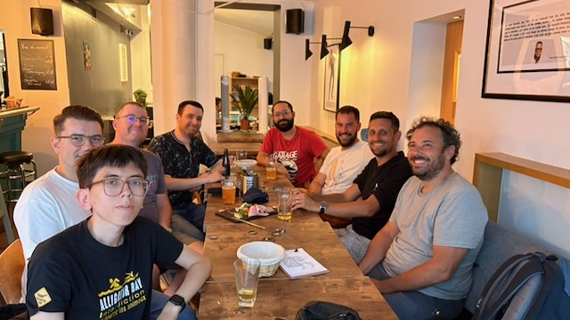
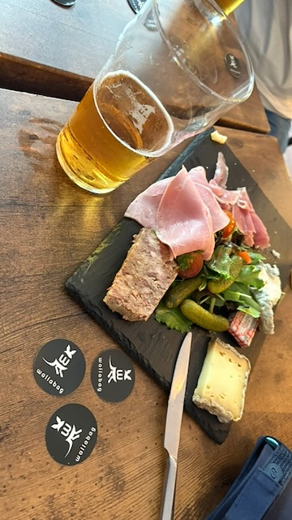

Après une première édition en 2025, nous renouvelons l'opération cette année.

Nous vous donnons rendez-vous le mercredi 29 juillet à partir de 18h30 au bar Chez Jean-Claude, 9 rue Vandamme (site internet : [https://www.chezjeanclaudeleretour.fr/](https://www.chezjeanclaudeleretour.fr/)).

Y'aura à boire, à manger et sûrement des autocollants wallabag 🦘

Si vous pensez être de la partie, pensez à remplir le sondage de participation : [https://beta.framadate.org/polls/b6cede884d27340afff1](https://beta.framadate.org/polls/b6cede884d27340afff1).

Si jamais le lieu devait changer (parce que nous serions trop de personnes ou pour toute autre raison), nous mettrions à jour ce billet de blog et nous communiquerions sur notre compte mastodon [https://fosstodon.org/@wallabag](https://fosstodon.org/@wallabag).

