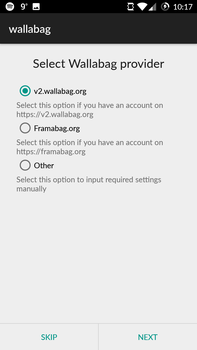

[Six months ago, we released wallabag 2.0](https://www.wallabag.org/blog/2016/04/03/wallabag-v2). [And exactly 3 years ago](https://www.wallabag.org/blog/2013/10/03/117), we launched wallabag 1.0. A big step in our short life: we rewrote the whole application to propose to you many great features. And it was also easier for us to develop with the help of the Symfony framework.

Since this release, we've worked on fixes (we [released 8 patches](https://www.wallabag.org/pages/releases.html)) and we developed many new features for wallabag 2.1.

Now, it's time to take a look at these new features!

## Import from ...

The recent news ([Instapaper is joining Pinterest](http://blog.instapaper.com/post/149374303661), [The Readability bookmarking service will shut down on September 30, 2016](https://medium.com/@readability/the-readability-bookmarking-service-will-shut-down-on-september-30-2016-1641cc18e02b#.jzcn686qt)) in the read-it-later ecosystem encouraged us to change our roadmap. We planned to work on the Tags feature for this 2.1 version but we worked hard on importing your data from 3rd-party services (but we've also made a few changes on the tags feature !).

  

    <h3>... Readability</h3>
    
At the end of August, Readability announced that its general public service will shut down on September 30. One day after this announce, j0k3r developed a Readability import. It's easy to use, you just need to select your Readability export on your computer and import it.

    
<em>Feature developed by <a href="https://github.com/j0k3r">j0k3r</a> in <a href="https://github.com/wallabag/wallabag/pull/2255">#2255</a></em>

  

  

    <h3>... Instapaper</h3>
    
The Instapaper service will not shut down (at least not right now), but it has been acquired by Pinterest. If you think that it's time to migrate to wallabag, our new importer is for you.

    
<em>Feature developed by <a href="https://github.com/j0k3r">j0k3r</a> in <a href="https://github.com/wallabag/wallabag/pull/2310">#2310</a></em>

  

  

    <h3>... Firefox and Chrome</h3>
    
In your favorite browser, you can save bookmarks, thousands of bookmarks. Now, you can also import them into wallabag. It's a just a file to export from your browser and import into your wallabag interface.

    
<em>Feature developed by <a href="https://github.com/tcitworld">tcitworld</a> in <a href="https://github.com/wallabag/wallabag/pull/2192">#2192</a></em>

  

## Asynchronous import will save your life (and your server!)

OK, you can import thousand of articles, but your web server can't process so much data: you'll most probably end up with a timeout error if you try to import too many articles.

[This problem exists in wallabag for years](https://github.com/wallabag/wallabag/issues?utf8=%E2%9C%93&q=is%3Aissue%20import%20fail%20is%3Aclosed%20).

That's why we worked on a system to fetch content and import articles into wallabag asynchronously: you ask wallabag to import your articles, wallabag saves all the URLs of these articles and then, a queue system fetches content while you're using wallabag.

In order to use this feature, wallabag needs [Redis](http://redis.io/) or [RabbitMQ](https://www.rabbitmq.com/). The wallabag documentation explains how to configure these services.

Beware : these services will certainly not be available if you use shared hosting.

<em>Feature developed by <a href="https://github.com/j0k3r">j0k3r</a> and <a href="https://github.com/nicosomb">nicosomb</a> in <a href="https://github.com/wallabag/wallabag/pull/1941">#1941</a></em>

  

    <h2>You can finally manage your users</h2>
    
You can now easily create, delete or edit an account in your wallabag instance. As an administrator of wallabag, you'll have a new interface, available in the menu: <strong>Users management</strong>.

    
<em>Feature developed by <a href="https://github.com/j0k3r">j0k3r</a> in <a href="https://github.com/wallabag/wallabag/pull/2327">#2327</a></em>

  

  

    <h2>You like an article? Share it with your friends!</h2>
    
This feature was claimed for months (<a href="https://github.com/wallabag/wallabag/issues/95">on 2 August, 2013!</a>). You can now share an article publicly: by clicking on the share menu in the sidebar of the article, you can generate a public link and share it on your favorite social network! Like inside your wallabag, the article is displayed in a comfortable view.

    
<em>Feature developed by <a href="https://github.com/nicosomb">nicosomb</a> in <a href="https://github.com/wallabag/wallabag/pull/1904">#1904</a></em>

  

## One more thing...

Dmitriy Bogdanov ([@di72nn](https://github.com/di72nn)) worked really hard on the Android app and came out with the following new features :

### A background service

It handles offline actions, like saving an article offline, marking an article as read, favoriting it or deleting it. These actions are then executed when it's possible.

### Automatic sync
You can sync local changes and download eventual new articles on a defined schedule. Local changes can also be synched as soon as the network is available. Finally, it's possible to download an article you just added.

### A new connection wizard
It helps you connecting to your wallabag instance. Just choose your instance or define its address, put it your credentials, and the wizard will automatically fetch connection informations.

### Notifications !
You get notifications when the app is syncing, and when an error occurs.

### A proper preferences screen
We got rid of the old ugly screen. Every option is saved when you change it.

## Full changelog

### Added

- [#1990](https://github.com/wallabag/wallabag/pull/1990) Added command line import for wallabag files (Nicolas Lœuillet)
- [#2142](https://github.com/wallabag/wallabag/pull/2142) Manage assets through npm (Thomas Citharel)
- [#2174](https://github.com/wallabag/wallabag/pull/2174) Added filter for tags on API (Thomas Citharel)
- [#2176](https://github.com/wallabag/wallabag/pull/2176) Added `since` parameter in API (Thomas Citharel)
- [#2170](https://github.com/wallabag/wallabag/pull/2170), [#2183](https://github.com/wallabag/wallabag/pull/2183) Added tags on entries view (Thomas Citharel)
- [#2186](https://github.com/wallabag/wallabag/pull/2186) Added option to disable registration (Thomas Citharel)
- [#1904](https://github.com/wallabag/wallabag/pull/1904) Share entry with a public URL (Nicolas Lœuillet)
- [#2243](https://github.com/wallabag/wallabag/pull/2243) Added list of untagged articles (Nicolas Lœuillet)
- [#2255](https://github.com/wallabag/wallabag/pull/2255) Added Readability import (Jeremy Benoist)
- [#2002](https://github.com/wallabag/wallabag/pull/2002) Added articles counter in sidebar (Nicolas Lœuillet)
- [#2275](https://github.com/wallabag/wallabag/pull/2275) Added date from entries in export (Jeremy Benoist)
- [#2266](https://github.com/wallabag/wallabag/pull/2266) Added tags counter in sidebar (Nicolas Lœuillet)
- [#1941](https://github.com/wallabag/wallabag/pull/1941) Added asynchronous import (Jeremy Benoist, Nicolas Lœuillet)
- [#2192](https://github.com/wallabag/wallabag/pull/2192) Added Firefox / Chrome bookmarks import (Thomas Citharel)
- [#2310](https://github.com/wallabag/wallabag/pull/2310) Added Instapaper import (Jeremy Benoist)
- [#2322](https://github.com/wallabag/wallabag/pull/2322) Added customized errors templates (Jeremy Benoist)
- [#2323](https://github.com/wallabag/wallabag/pull/2323) Added simple stats in footer (Jeremy Benoist)
- [#2324](https://github.com/wallabag/wallabag/pull/2324) Added ability to edit a tagging rule (Jeremy Benoist)
- [#2325](https://github.com/wallabag/wallabag/pull/2325) Added an `exists` endpoint in API (Jeremy Benoist)

### Changed

- [#2170](https://github.com/wallabag/wallabag/pull/2170) Entry titles are now smaller on entry view (Thomas Citharel)
- [#2245](https://github.com/wallabag/wallabag/pull/2245) Changed where page title is displayed (Nicolas Lœuillet)
- [#2274](https://github.com/wallabag/wallabag/pull/2274) Re use JsonResponse in API (Jeremy Benoist)
- [#2257](https://github.com/wallabag/wallabag/pull/2257) Use created date for imported content (Jeremy Benoist)
- [#2326](https://github.com/wallabag/wallabag/pull/2326) Quickstart layout (Nicolas Lœuillet)

### Fixed

- [#2328](https://github.com/wallabag/wallabag/pull/2328) Fixed duplicate URL with accents (Jeremy Benoist)
- [#2319](https://github.com/wallabag/wallabag/pull/2319) Fixed `gd` extension missing in Dockerfile (Pascal Martin)
- [#2313](https://github.com/wallabag/wallabag/pull/2313) Fixed long loading on Firefox (Nicolas Lœuillet)
- [#2320](https://github.com/wallabag/wallabag/pull/2320) Fixed user config which wasn't created in some cases (Jeremy Benoist)
- [#2301](https://github.com/wallabag/wallabag/pull/2301) Fixed feeds not syncing on android application (Thomas Citharel)
- [#2308](https://github.com/wallabag/wallabag/pull/2308) Fixed duplicate tags on import (Jeremy Benoist)
- [#2297](https://github.com/wallabag/wallabag/pull/2297) Fixed epub export with special characters in title (morhelluin)
- [#2292](https://github.com/wallabag/wallabag/pull/2292) Fixed label for mark as read link in entry view (Nicolas Lœuillet)
- [#2260](https://github.com/wallabag/wallabag/pull/2260) Fixed different font-size for labels in config screen (Nicolas Lœuillet)
- [#2242](https://github.com/wallabag/wallabag/pull/2242) Fixed print / article views (Nicolas Lœuillet)
- [#2328](https://github.com/wallabag/wallabag/pull/2328) Avoid duplicate url with accents (Jeremy Benoist)
- [#2330](https://github.com/wallabag/wallabag/pull/2330) Remove error message when creating ePub versions (Paulino Michelazzo)
- [#2331](https://github.com/wallabag/wallabag/pull/2331) Fix parameters in API links (Jeremy Benoist)

### Removed

- [#2318](https://github.com/wallabag/wallabag/pull/2318) Removed duplicated templates files (Nicolas Lœuillet)
- [#2287](https://github.com/wallabag/wallabag/pull/2287) Useless area in footer for material theme (Nicolas Lœuillet)

## Download wallabag 2.1

To download, install/upgrade wallabag, [please read our Downloads page](https://www.wallabag.org/pages/download-wallabag.html).

## Need help?

[We are on Gitter](https://gitter.im/wallabag/wallabag) (a chat platform), ping us! You can also open a [new issue on GitHub](https://github.com/wallabag/wallabag/issues/new).

## How can you help us?

By using wallabag, by reporting bugs, by translating wallabag and its documentation, by talking about wallabag to your friends, ...
