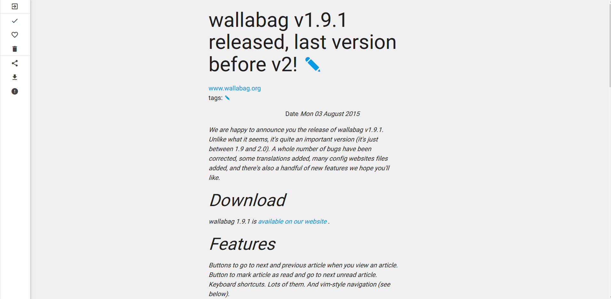

It's been a week since [we've released v1.9.1](https://www.wallabag.org/blog/2015/08/03/wallabag-v1.9.1-released) and it seems there's no major bug coming out. That's great, because it leave us time to work on v2. We'll show you how much we've progressed later, I just wanted to say a word about our browser extensions.

## Chrome Extension
The chrome extension has been updated with the right click-menu function named *Add page to wallabag*, as you can see on the picture below.

This update has been pushed three days ago on the Chrome Web Store, so you should have got it by now.

## Opera Extension
Although Opera is having a [hard time right now](http://www.computerworld.com/article/2968277/web-browsers/opera-browser-maker-up-for-sale.html), we don't forget users who use this browser. So we added [a documentation chapter](http://doc.wallabag.org/en/User/save_your_first_article.html#opera) in order for users to install it, while the extension is currently submitted and is awaiting validation. It's far from perfect (the right-click menu item opens a new window), but hey it's here.
We'll update this post to share with you the URL of the Opera Extension Repository when we'll get it.

## Firefox Social API
Some of you may have missed it, but since Firefox 38.0.5, Pocket is integrated by default in Mozilla's browser. We were quite sad about this integration which surprised us. So [we wrote to Mozilla and they said](http://www.cdetc.fr/reponse-mozilla) they were working on something so that other read-it-later services can be included. We'll see about that. And we're eager to work with you, red panda !

Apart from this, we've launched with wallabag 1.9.1 the wallabag Firefox Service (go into Config to discover it - https needed). It's quite basic, but it will be much more elaborated with wallabag v2 and it's API, just like all extensions and mobile apps.

## wallabag v2
Now for the big stuff. It comes. There have been quite some work, but the most important thing right now is the arrival of a new theme in material style logically called *material*. This theme should be the main one on v2. We all can thank Alexandr Danilov for his work.

Here's a preview below :

The best news is that you can test it yourself at [v2.wallabag.org](v2.wallabag.org). Just keep in mind that it's in alpha state, and many features are missing. But it's just a matter of time.

We'll keep you updated when a real alpha is available for you to test in the upcoming weeks, and remember you can help our project. I remind you [our main issue](https://github.com/wallabag/wallabag/issues/1254) explaining on how you can help.

See you soon,

Thomas
