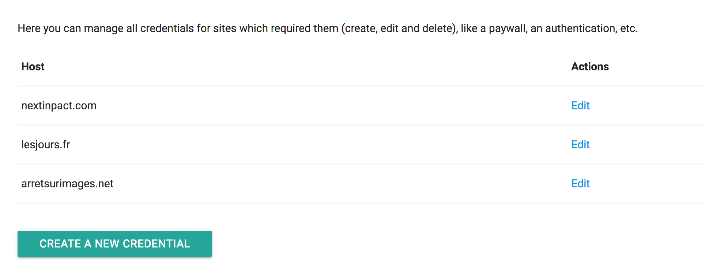

Be prepared.

**Our new great version, wallabag 2.3, is there**. We are a little bit late, yes. But we are still alive. 

**It’s now time to present you this new great version**.

## What’s new?

### Sites with paywall

In wallabag 2.2, we added the availability to save articles on websites who an authentication is required. It was a little bit tricky to configure, because you needed to edit files.

**But our so great @j0k3r created an interface to easily handle your credentials**. 

In Site credentials, you need to create a new credential by typing the domain name (without the https://www. part – we'll improve it soon), your username and your login. All is encrypted in your database. If you want more details, [you can read the specifications here](https://github.com/wallabag/wallabag/pull/2683). 

Today, you can save articles from NextInpact.com, ArretSurImages.net, Mediapart.fr, Monde-diplomatique.fr, CourrierInternational.com and in coming days, Alternatives-Economiques.fr, Telegraph.co.uk, LeFigaro.fr and LeMonde.fr will be available. If you want to add new websites, please contact us.

### Other features

* you can now remove all your archived entries by one click (on the config screen)
* we store publication date and author of each article if our system can detect them
* we added a notmaches operator for the automatic tagging rules (available on the config screen)
* there is a confirmation when you want to delete an article to avoid mistake
* we added tags on the list view
* thanks to the filters, you can now retrieve easily the articles which were shared publicly. We also improve the public view of the articles.
* we added RSS for tags and for all entries
* желанный! wallabag speaks Russian 🇷🇺!
* you can now store the origin URL of an article (for example, the tweet where you found the link) by editing the article (click on the pencil on the article view).

## Changelog complet

### API

- API `exists` returns `id` if article exists [#2919](https://github.com/wallabag/wallabag/pull/2919)
- Added API endpoint to handle a list of URL and to add/delete tags [#3055](https://github.com/wallabag/wallabag/pull/3055)
- Added API endpoint to handle a list of URL [#3053](https://github.com/wallabag/wallabag/pull/3053)
- Retrieve tag / tags value from query or request [#3103](https://github.com/wallabag/wallabag/pull/3103)
- Register through API [#3065](https://github.com/wallabag/wallabag/pull/3065)
- API user creation behind a toggle [#3177](https://github.com/wallabag/wallabag/pull/3177)
- Allow other fields to be sent using API [#3106](https://github.com/wallabag/wallabag/pull/3106)
- Add ability to patch an entry with more fields [#3181](https://github.com/wallabag/wallabag/pull/3181)
- Create (and return) a client after creating a new user using the API [#3187](https://github.com/wallabag/wallabag/pull/3187)
- Fix PATCH method [#3256](https://github.com/wallabag/wallabag/pull/3256)

### Technical stuff

- Dropping PHP 5.5 [#2861](https://github.com/wallabag/wallabag/pull/2861), migrated to Symfony 3.3 [#3376](https://github.com/wallabag/wallabag/pull/3376), defined MySQL as the default rdbms for wallabag [#3171](https://github.com/wallabag/wallabag/pull/3171)
- Add Cloudron as installation method [#3000](https://github.com/wallabag/wallabag/pull/3000)
- Added migrations execution after fresh install [#3088](https://github.com/wallabag/wallabag/pull/3088)
- Upgraded CraueConfigBundle to 2.0 [#3113](https://github.com/wallabag/wallabag/pull/3113)
- Removed embedded documentation. [The repository is now here](https://github.com/wallabag/doc). [#3122](https://github.com/wallabag/wallabag/pull/3122)
- Fix some Scrutinizer issues [#3161](https://github.com/wallabag/wallabag/pull/3161) [#3172](https://github.com/wallabag/wallabag/pull/3172)
- Isolated tests [#3137](https://github.com/wallabag/wallabag/pull/3137)
- Log an error level message when user auth fail [#3195](https://github.com/wallabag/wallabag/pull/3195)
- Add a real configuration for CS-Fixer [#3258](https://github.com/wallabag/wallabag/pull/3258)
- Replace ant with Makefile [#3398](https://github.com/wallabag/wallabag/pull/3398)

### Features

- Share articles to Scuttle (https://github.com/scronide/scuttle) instance [#2999](https://github.com/wallabag/wallabag/pull/2999)
- Allow to remove all archived entries [#3020](https://github.com/wallabag/wallabag/pull/3020) 
- Added publication date and author [#3024](https://github.com/wallabag/wallabag/pull/3024)
- Added `notmatches` operator for automatic tagging rule [#3047](https://github.com/wallabag/wallabag/pull/3047)
- Search & paginate users [#3060](https://github.com/wallabag/wallabag/pull/3060)
- **Clean duplicates entries** command [#2920](https://github.com/wallabag/wallabag/pull/2920)
- Added headers field in Entry [#3108](https://github.com/wallabag/wallabag/pull/3108)
- Add some deletion confirmation to avoid mistake [#3147](https://github.com/wallabag/wallabag/pull/3147)
- Add support for tag in Instapaper import [#3168](https://github.com/wallabag/wallabag/pull/3168)
- Added tags on list view [#3077](https://github.com/wallabag/wallabag/pull/3077)
- **Show user** command [#3179](https://github.com/wallabag/wallabag/pull/3179)
- Add ability to filter public entries & use it in the API [#3208](https://github.com/wallabag/wallabag/pull/3208)
- Store credentials for restricted site in database [#2683](https://github.com/wallabag/wallabag/pull/2683)
- Add RSS for tags & All entries [#3207](https://github.com/wallabag/wallabag/pull/3207)
- Add **list users** command [#3301](https://github.com/wallabag/wallabag/pull/3301)
- Add **reload entry** command [#3326](https://github.com/wallabag/wallabag/pull/3326)
- Add starred_at field which is set when an entry is starred [#3330](https://github.com/wallabag/wallabag/pull/3330)
- Add originUrl property to Entry [#3346](https://github.com/wallabag/wallabag/pull/3346)

### Changes

- Changed default value for list mode (grid instead of list) [#3014](https://github.com/wallabag/wallabag/pull/3014)
- Remove `isPublic` from Entry entity [#3030](https://github.com/wallabag/wallabag/pull/3030)
- Use username to import [#3080](https://github.com/wallabag/wallabag/pull/3080)
- Adds Webpack support and remove Grunt [#3022](https://github.com/wallabag/wallabag/pull/3022) 
- Improved Guzzle subscribers extensibility [#2751](https://github.com/wallabag/wallabag/pull/2751)
- Added logger when we match Tagging rules [#3110](https://github.com/wallabag/wallabag/pull/3110)
- unify Download/Export wording. [#3130](https://github.com/wallabag/wallabag/pull/3130)
- Staying on an article view after removing a tag [#3138](https://github.com/wallabag/wallabag/pull/3138)
- Use an alternative way to detect images [#3184](https://github.com/wallabag/wallabag/pull/3184)
- Displays an error with an annotation with a too long quote [#3093](https://github.com/wallabag/wallabag/pull/3093)
- Validate language & preview picture fields [#3192](https://github.com/wallabag/wallabag/pull/3192)
- remove craueconfig domain name setting and add a proper one in parameters [#3173](https://github.com/wallabag/wallabag/pull/3173)
- Better public sharing page [#3204](https://github.com/wallabag/wallabag/pull/3204), [#3449](https://github.com/wallabag/wallabag/pull/3449)
- Improved pagination, navigation, tag's list and footer UI [#3459](https://github.com/wallabag/wallabag/pull/3459), [#3467](https://github.com/wallabag/wallabag/pull/3467), [#3461](https://github.com/wallabag/wallabag/pull/3461), [#3463](https://github.com/wallabag/wallabag/pull/3463)

### Fixes

- Use up-to-date Firefox extension and add F-Droid link for Android app [#3057](https://github.com/wallabag/wallabag/pull/3057)
- Fixed sandwich menu position in entry view (material theme) [#3073](https://github.com/wallabag/wallabag/pull/3073)
- Disabled shortcuts on login/register page [#3075](https://github.com/wallabag/wallabag/pull/3075)
- "+" in url not parsed correctly (when we click on original URL) [#3002](https://github.com/wallabag/wallabag/pull/3002)
- Skip auth when no credentials are found [#3101](https://github.com/wallabag/wallabag/pull/3101)
- Added migration to change length for user fields [#3104](https://github.com/wallabag/wallabag/pull/3104)
- Fix delete annotation when username is defined [#3120](https://github.com/wallabag/wallabag/pull/3120)
- Fixed is_starred for wallabag v2 import [#3143](https://github.com/wallabag/wallabag/pull/3143)
- Replace images with & in url [#3176](https://github.com/wallabag/wallabag/pull/3176)
- Ignore tag's case [#3139](https://github.com/wallabag/wallabag/pull/3139)
- Multiple tag search, which was broken from API [#3309](https://github.com/wallabag/wallabag/pull/3309)
- In RSS feeds, pubDate now conformant to DateTime RFC822 specifications [#3471](https://github.com/wallabag/wallabag/pull/3471)

### Translations

- Add Russian language [#3378](https://github.com/wallabag/wallabag/pull/3378)

## Download wallabag 2.3

To **download, install/upgrade wallabag**, [please read our Downloads page](http://doc.wallabag.org/en/master/user/installation.html#installation).

## Don’t want to host wallabag by yourself? 

On December 2016, [**wallabag.it** was launched](https://wallabag.it). wallabag.it is a paid service to use wallabag without installing it on a web server. 

This service already ships wallabag 2.3. [You can create your account here](https://app.wallabag.it/). Try it for free: you'll get a 14-day free trial with no limitation (no credit card information required).

## Need help?

[We are on Gitter](https://gitter.im/wallabag/wallabag) and [on IRC](irc://irc.freenode.net/wallabag), ping us! You can also open a [new issue on GitHub](https://github.com/wallabag/wallabag/issues/new).

## How can you help us?

By using wallabag, by reporting bugs, by translating wallabag and its documentation, by talking about wallabag to your friends, ...